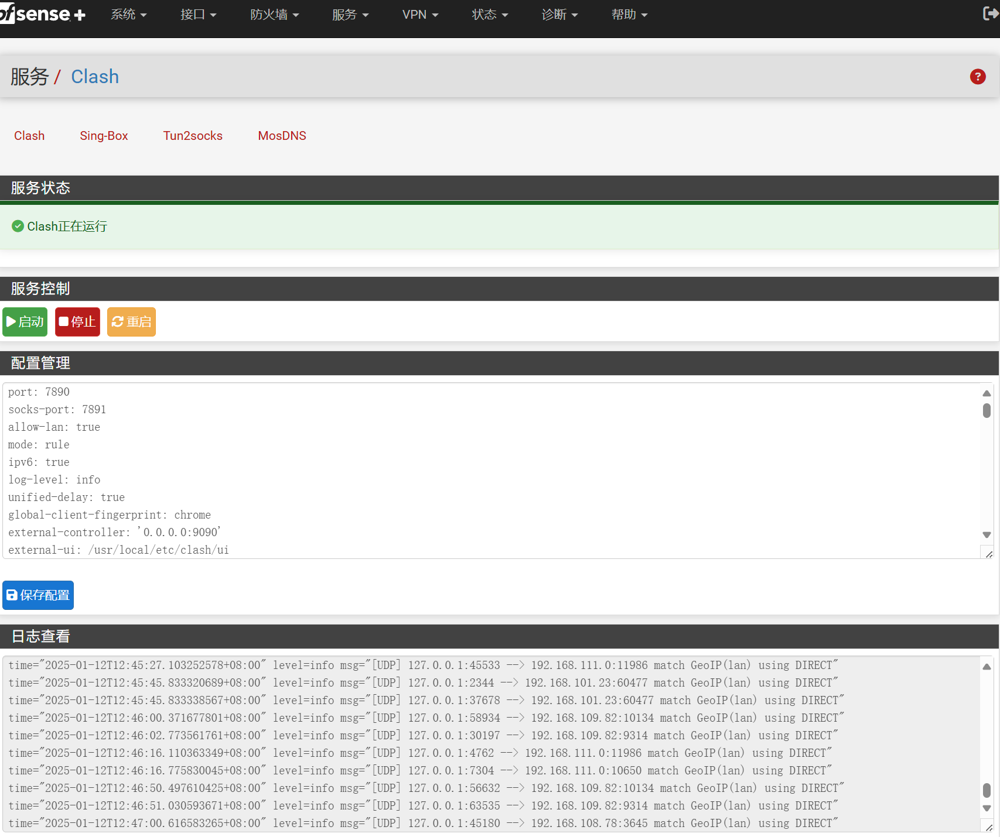
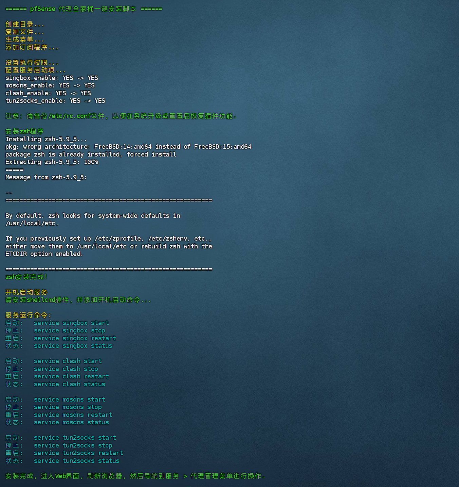

## pfSense代理套件
一键安装代理脚本，用于在pfSense上运行Clash、Sing-Box、Tun2socks和Mosdns。支持Clash订阅转换、透明代理和DNS分流。带Web控制界面，可以进行配置修改、程序控制、日志查看。 在pfSense plus 24.11上测试通过。



## 项目源代码
该项目集成了以下工具：

[Clash (mihomo)](https://github.com/MetaCubeX/mihomo/releases) 

[Sing-Box](https://github.com/SagerNet/sing-box) 

[Tun2socks](https://github.com/xjasonlyu/tun2socks) 

[Mosdns](https://github.com/IrineSistiana/mosdns) 

[YACD](https://github.com/haishanh/yacd) 

[Subconverter](https://github.com/tindy2013/subconverter)


## 注意事项
1. 脚本不提供任何订阅信息，请准备好自己的Clash订阅URL，示例配置仅供参考。

2. 使用订阅功能前，请手动修改`env`文件中的`CLASH_URL`变量，否则脚本将无法正确运行。

3. 仅支持x86_64 平台。

## 安装方法
下载并解压压缩包，上传到防火墙中，进入目录后运行以下命令：

```bash
sh install.sh
```

如下图所示：


## 使用方法
请参考以下文章：
[pfSense代理全家桶安装配置教程](https://pfchina.org/?p=14123)

## 常见问题
如果订阅转换不起作用，可以使用[SublinkX](https://github.com/gooaclok819/sublinkX)工具搭建自己的订阅转换平台。

## 参考资料
- [pfSense、OPNsense配置Xray代理教程](https://pfchina.org/?p=13013)  
- [pfSense、OPNsense配置trojan-go教程](https://pfchina.org/?p=9885)  
- [pfSense、OPNsense配置v2ray代理教程](https://pfchina.org/?p=4032)  
- [pfSense、OPNsense配置Clash代理教程](https://pfchina.org/?p=10526)  
- [pfSense、OPNsense配置hysteria代理教程](https://pfchina.org/?p=9524)  
- [pfSense、OPNsense设置http透明代理教程](https://pfchina.org/?p=13572)  
- [pfSense、OPNsense配置sing-box代理教程](https://pfchina.org/?p=12933)  
- [pfSense、OPNsense配置hysteria2代理教程](https://pfchina.org/?p=13065)  
- [pfSense、OPNsense配置tun2socks透明代理](https://pfchina.org/?p=13437)  
- [pfSense、OPNsense配置hysteria(TUN) 透明代理教程](https://pfchina.org/?p=13480)
